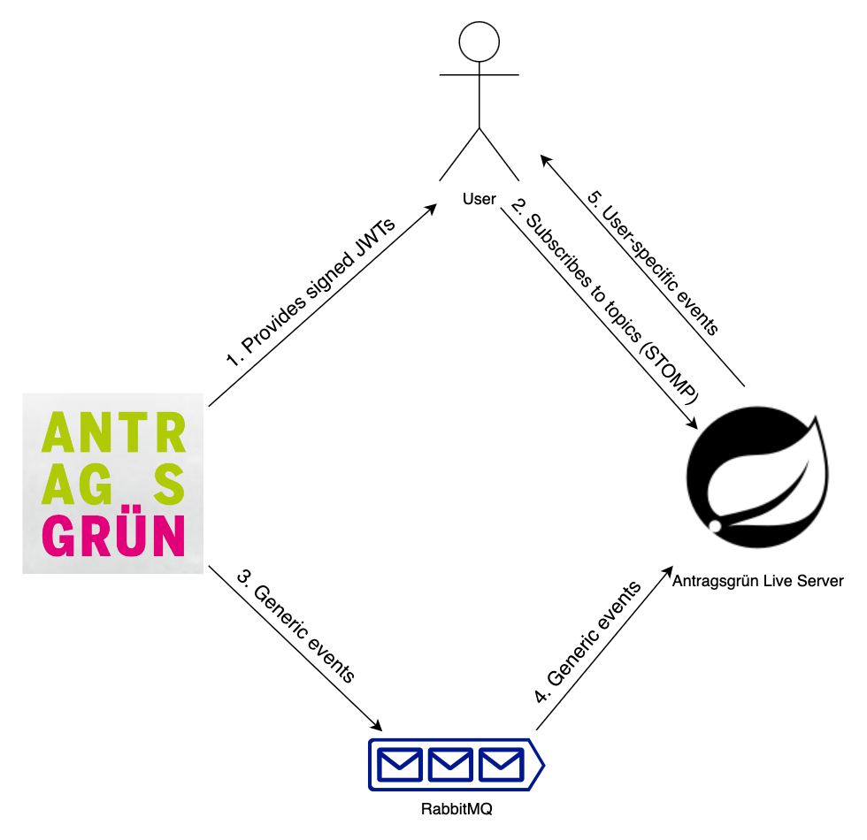

# Real-time communication for Antragsgrün

[Antragsgrün](https://github.com/CatoTH/antragsgruen) is mostly a traditional Content Management System, designed to run on a wide variety of hosting environments, including shared hosting providers that provide no means of using websockets or long-running processes necessary for real-time communication. Therefore, interactive components like the speaking lists and the voting system use HTTP polling by default, which works for smaller events.


This Live Server is an optional component that can be deployed for larger setups and solves two issues of the traditional approach: 1) the latency of updates with which changes are propagated to web clients (which comes from the polling frequency), and 2) the load that this approach puts on the server, which tends to be an issue with larger voting sessions.
<br>
<br>
Users are connecting to the Live Server via Websocket/STOMP when using an interactive part of Antragsgrün. Whenever an update to the internal state of the system happens, the main Antragsgrün system publishes a message with the new state to a message queue (RabbitMQ, at the moment), to be consumed by this Live Server. This processes the new state, transforms it to user-specific objects (which matches exactly the structure that the traditional polling HTTP endpoint would return) and actively sends it to the relevant connected users.

## Authentication

- The central Antragsgrün system authenticates users through traditional means (cookie-based sessions generated during username/password- or SAML-based login).
- It creates a JWT, signed using a private key (RS256), containing information about:
  - The installation ID, as the Issuer of the token.  
  - The ID of the user as Subject of the token. If the user is logged in, it has the shape of `login-123`. If not, a session-token like `anonymous-qVnRU4NFICsBGtnWfi0dzGgWcKGlQoiN` will be used.
  - If the user has specific admin privileges (like to administer speech queues), a role is added to the payload. Currently, only ROLE_SPEECH_ADMIN is supported.
  - The site and consultation the token is valid for, as the payload of the token.
- We web browser connects to the websocket / STOMP server of this Live Server. The authentication and authorization is checked at the following places:
  - When connecting, the validity of the JWT is checked on a protocol level (as part of [WebsocketChannelInterceptor](src/main/java/de/antragsgruen/live/websocket/WebsocketChannelInterceptor.java)).
  - The installation, site and consultation association is checked when subscribing to topics - the installation, site subdomain and consultation path has to be in the topic name and equal to information provided in the JWT.
  - When subscribing to the speech admin topic, the SPEECH_ADMIN role is checked in the JWT.
  - SECURITY DISCLAIMER: the expiry date of the token is currently only checked when connecting. As long as the session is open, no expiry mechanism is in place, so revoking a user's access only has effect once that user reconnects.

## ID Mapping

The IDs referred to by this service can be found at the following places in the central Antragsgrün system:

- Installation ID: This is the ID specified as `live.installationId` in `config.json`. One Installation ID can hold either a single- or multi-site installation.
- Site: The subdomain used by a multi-site installation (field `subdomain` in the `site` database table). For single-site installations, this is typically `std`.
- Consultation: The URL path component identifying the specific consultation within a site (field `urlPath` in the `consultation` database table).
- User ID: The numerical ID of the user (field `id` in the `user` database table).

## RabbitMQ Setup

The central Antragsgrün system publishes all its messages to one central exchange (by default: `antragsgruen-exchange`). Messages to all subdomains and consultations within a subdomain are published through that exchange, but are classified by a routing key pattern.

The following routing key patterns are fixed, while its associated queues can be configured:
- `user.[installationid].[site].[consultation].[userid]`, e.g. `user.localdev.stdparteitag.std-parteitag.1` contains messages directed to one particular user, by default being bound to the queue `antragsgruen-user-queue` and using the [MQUserEvent](src/main/java/de/antragsgruen/live/rabbitmq/dto/MQUserEvent.java)-DTO for deserialization.
- `speech.[installationid].[site].[consultation]`, e.g. `speech.localdev.stdparteitag.std-parteitag` contains messages updating a speech queue, by default being bound to the queue `antragsgruen-speech-queue` and using the [MQSpeechQueue](src/main/java/de/antragsgruen/live/rabbitmq/dto/MQSpeechQueue.java)-DTO for deserialization. All users in the consultation receive this event, but in a personalized version.

In case messages cannot be processed by this live server, they are rejected and, through the `antragsgruen-exchange-dead`, end up in the dead letter queues `antragsgruen-queue-speech-dead` and `antragsgruen-queue-user-dead`.

## Exposed Websocket STOMP Topics

- `/user/[installationid]/[subdomain]/[consultation]/[userid]/speech`
- `/admin/[installationid]/[subdomain]/[consultation]/[userid]/speech`
- `/topic/[installationid]/[subdomain]/[consultation]/[...]` (currently not used)


## Installing, Running, Configuration

### Prerequisites

Before building the app, two steps have to be manually performed:
- Creating a public/private RSA key for the JWT signing. This app only needs the public key, passed into the application along with the installation ID as an environment variable. If you are just testing, the keys from the test suite can be used.
- Installing Stomp.JS. This can be done by calling `npm ci`. After this step, the file `src/main/resources/static/stomp.umd.min.js` should exist.

### Running

This app requires a RabbitMQ to be running. The app can be compiled and started using:

```shell
./mvnw spring-boot:run
```

Hint: this is only meant for local development. On production, you want to secure the actuator endpoints, as they are not really protected in this basic setup (see [application.yml](src/main/resources/application.yml)).

### Configuration via Environment Variables

One or multiple installations can be configured through environment variables. Each installation needs to have an ID and a public key. Mind that the numbering needs to be consecutive, starting with zero.

| Environment Variable Name               | Explanation                                                  |
| --------------------------------------- | ------------------------------------------------------------ |
| ANTRAGSGRUEN_INSTALLATIONS_0_ID         | Unique ID of the Antragsgrün installation                    |
| ANTRAGSGRUEN_INSTALLATIONS_0_PUBLIC_KEY | Public RSA Key. Refer to the [README in the Central System](https://github.com/CatoTH/antragsgruen?tab=readme-ov-file#jwt-key-signing) on how to generate one. |
| ...                                     | ...                                                          |

The following aspects can be configured through environment variables, especially valuable when deploying it via docker (compose):

| Environment Variable Name | Default Value    | Explanation                                                  |
| ------------------------- | ---------------- | ------------------------------------------------------------ |
| ANTRAGSGRUEN_WS_ORIGINS   | http://localhost | Web origin to accept web requests from, e.g. http://*.antragsgruen.de. Multiple comma-separated patterns can be provided. |
| RABBITMQ_HOST             | localhost        | RabbitMQ Hostname                                            |
| RABBITMQ_VHOST            | /                | RabbitMQ VirtualHost                                         |
| RABBITMQ_USERNAME         | guest            | RabbitMQ Management Username                                 |
| RABBITMQ_PASSWORD         | guest            | RabbitMQ Management Password                                 |
| ACTUATOR_USER             | admin            | Username to access the Actuator through Web                  |
| ACTUATOR_PASSWORD         | admin            | Password to access the Actuator through Web                  |

It is also possible, though hardly ever necessary, to configure the following aspects of the RabbitMQ setup:

| Environment Variable Name  | Default Value                  | Explanation                                              |
| -------------------------- | ------------------------------ | -------------------------------------------------------- |
| RABBITMQ_EXCHANGE          | antragsgruen-exchange          | The exchange that Antragsgrün is supposed to publish to  |
| RABBITMQ_EXCHANGE_DEAD     | antragsgruen-exchange-dead     | The exchange that failed messages are published to       |
| RABBITMQ_QUEUE_USER        | antragsgruen-queue-user        | The queue for user-targeted messages                     |
| RABBITMQ_QUEUE_USER_DEAD   | antragsgruen-queue-user-dead   | The dead letter queue for user-targeted messages         |
| RABBITMQ_QUEUE_SPEECH      | antragsgruen-queue-speech      | The queue for speaking-list related messages             |
| RABBITMQ_QUEUE_SPEECH_DEAD | antragsgruen-queue-speech-dead | The dead letter queue for speaking-list related messages |

### Compiling for GraalVM

Setup on macOS:
```shell
brew install --cask graalvm/tap/graalvm-jdk21
export JAVA_HOME=/Library/Java/JavaVirtualMachines/graalvm-jdk-21/Contents/Home
```

Compiling and running:
```shell
./mvnw native:compile -Pnative
./target/live
```

### Running with Docker (JRE)

A dummy docker-compose.yml is provided that builds and runs the application. This docker compose setup also sets up Metrics collection via Prometheus and Grafana.

To enable Grafana, copy [prometheus.demo.yml](docker/prometheus/prometheus.demo.yml) to `prometheus.yml`, and set the same credentials as configured through `ACTUATOR_USER` / `ACTUATOR_PASSWORD`.

```shell
docker compose -f docker-compose.jdk.yml build
docker compose -f docker-compose.jdk.yml up
```


## Testing

### Running spotbugs && checkstyle

```shell
./mvnw compile && ./mvnw spotbugs:check && ./mvnw checkstyle:check
```

### Running the integration tests

Currently, there is one integration test that tests the RabbitMQ-receiver, the data mapping and the WS/STOMP-Server by connecting to the STOMP-Server using a self-signed JWT for authentication, then sends a message to RabbitMQ and tests what message gets delivered through the STOMP-Connection.

The test case is located in [LiveApplicationTests.java](src/test/java/de/antragsgruen/live/LiveApplicationTests.java), some helper classes in [utils](src/test/java/de/antragsgruen/live/utils) and the test fixtures (JSON Payloads) in [resources](src/test/resources).

To run the tests, call:
```shell
npm ci # Only needed once
./mvnw test
```

Note that Docker needs to be installed for this, too, as the integration test makes use of RabbitMQ.

### JWTs for tests

The public / private keys used for the test cases were created using the following commands:
```shell
ssh-keygen -t rsa -b 4096 -m PEM -f bundle.pem
openssl rsa -in bundle.pem -pubout -outform PEM -out jwt-test-public.key
openssl pkcs8 -topk8 -inform PEM -outform PEM -in bundle.pem -out jwt-test-private.key -nocrypt
```
